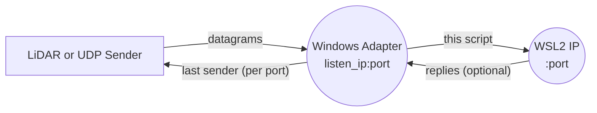

# UDP Forwarder: Windows ⇄ WSL2 (LiDAR‑friendly)

> A tiny, user‑space UDP proxy that forwards packets arriving on a Windows network adapter to your WSL2 instance — with optional bidirectional mode to relay responses back to the last sender (e.g., a LiDAR).

[](#requirements) [](#requirements) [](#license)

---

## Table of Contents

* [Overview](#overview)
* [How it works](#how-it-works)
* [Requirements](#requirements)
* [Installation](#installation)
* [Usage](#usage)

  * [Common examples](#common-examples)
  * [CLI options](#cli-options)
* [Performance tips](#performance-tips)
* [Test & debugging](#test--debugging)
* [Troubleshooting](#troubleshooting)
* [Security notes](#security-notes)
* [FAQ](#faq)
* [License](#license)

---

## Overview

Some sensors (like 2D/3D LiDARs) stream high‑rate UDP packets to a Windows host. When your processing stack lives inside **WSL2**, those packets don’t automatically reach Linux sockets. This script bridges that gap — **no admin privileges, no NAT rules, no portproxy**. It simply listens on your Windows adapter and forwards datagrams to your WSL2 IP on the same ports.

* **Unprivileged**: Runs in user space; no firewall or route hacking required in the default case.
* **Fast enough for LiDAR**: Large socket buffers and minimal logging.
* **Bidirectional** (optional): Forwards replies from WSL2 back to the **last** sender observed on the Windows side for each port.
* **Subnet filter** (optional): Accept only packets from a given CIDR (e.g., your LiDAR network).

## How it works



* One forwarding thread per port.
* Windows‑side packets → forwarded to **WSL2\_IP\:port**.
* With `--bidirectional`, packets coming **from** WSL2 are relayed back to the **last Windows‑side sender** seen on that port.

## Requirements

* Windows 10/11 with **WSL2** installed and running.
* Python **3.8+** on Windows (run the script from Windows, not inside WSL).
* A Windows network adapter receiving the UDP stream (e.g., `192.168.198.1`).

> Tip: Your WSL2 IP is auto‑detected via `wsl.exe hostname -I`. You can override with `--wsl2-ip`.

## Installation

```bash
# 1) Clone
git clone https://github.com/USERNAME/udp-forward-wsl2.git
cd udp-forward-wsl2

# 2) (Optional) create a venv
python -m venv .venv && .venv/Scripts/activate  # PowerShell: . .venv/Scripts/Activate.ps1

# 3) Install runtime deps (none besides stdlib)
# Ready to run
```

## Usage

Run the script from **Windows** (PowerShell or CMD). Examples assume your Windows adapter is `192.168.198.1` and LiDAR ports are `2368/2369`.

### Common examples

Forward LiDAR data on 2368 and 2369 to your current WSL2 IP:

```powershell
python udp_forward_wsl2.py --listen-ip 192.168.198.1 --ports 2368 2369
```

Listen on all adapters (useful when unsure which NIC receives the stream):

```powershell
python udp_forward_wsl2.py --listen-ip 0.0.0.0 --ports 2368
```

Enable bidirectional relay (WSL2 → last LiDAR sender):

```powershell
python udp_forward_wsl2.py --listen-ip 192.168.198.1 --ports 2368 --bidirectional
```

Override auto‑detected WSL2 IP:

```powershell
python udp_forward_wsl2.py --listen-ip 192.168.198.1 --wsl2-ip 172.20.153.45 --ports 2368
```

Restrict accepted sources to a subnet (drop others):

```powershell
python udp_forward_wsl2.py --listen-ip 192.168.198.1 --ports 2368 --lidar-subnet 192.168.198.0/24
```

Quiet mode:

```powershell
python udp_forward_wsl2.py --listen-ip 192.168.198.1 --ports 2368 --quiet
```

### CLI options

```
--listen-ip       Windows adapter IP to bind (e.g., 192.168.198.1). Use 0.0.0.0 to listen on all.
--ports           Space‑separated UDP ports to forward (e.g., 2368 2369). Required.
--wsl2-ip         Override auto‑detected WSL2 IPv4 (via `wsl hostname -I`).
--lidar-subnet    Optional CIDR filter to accept only packets from this subnet.
--bidirectional   Also forward packets from WSL2 back to the last Windows‑side sender.
--quiet           Reduce console output.
```

## Performance tips

* **Keep the console focused** (avoid heavy background output) while ingesting high‑rate streams.
* Large buffers are pre‑set: `RECVBUF_BYTES=SENDBUF_BYTES=4 MB`. You can tweak them in the source if needed.
* Prefer binding to a **specific adapter IP** instead of `0.0.0.0` to reduce stray traffic.
* Disable verbose logging unless debugging.

## Test & debugging

### Quick fake sender (Windows → WSL2)

From Windows, simulate a sender to verify forwarding into WSL2 (replace `<WSL2_IP>` and port):

```powershell
$end = New-Object System.Net.IPEndPoint ([ipaddress]::Parse("192.168.198.1"), 2368)
$udp = New-Object System.Net.Sockets.UdpClient
$bytes = [Text.Encoding]::ASCII.GetBytes("hello lidar")
$udp.Send($bytes, $bytes.Length, $end) | Out-Null
```

Then in **WSL2**:

```bash
nc -ul 2368   # or: socat -u UDP-RECV:2368 STDOUT
```

You should see `hello lidar` in WSL2.

### Test bidirectional path

In **WSL2** send back a reply:

```bash
echo "pong" | socat -u - UDP-SENDTO:192.168.198.1:2368
```

With `--bidirectional` enabled, the script will relay this to the last Windows‑side sender on that port.

### Inspect traffic

* Use **Wireshark** or `tcpdump` on Windows/WSL2 to confirm flows.
* PowerShell quick check:

```powershell
Get-NetUDPEndpoint | Where-Object { $_.LocalPort -in 2368,2369 }
```

## Troubleshooting

* **“Could not detect WSL2 IPv4”** → Ensure a WSL2 distro is running (`wsl -l -v`) or pass `--wsl2-ip`.
* **No packets in WSL2** → Verify the Windows adapter IP is correct and the sensor is targeting that IP. Try `--listen-ip 0.0.0.0`.
* **Firewall** → Normally not required, but if you’ve hardened rules, allow inbound UDP on the chosen ports for the bound adapter.
* **Multiple senders** → Bidirectional replies go only to the **last** observed sender per port.
* **Port already in use** → Another program is bound. Pick a different port or stop the conflicting app.

## Security notes

* This is a **raw UDP forwarder**. It does not authenticate peers, rate‑limit, or encrypt traffic.
* Use `--lidar-subnet` to restrict sources when on shared networks.
* Avoid `--listen-ip 0.0.0.0` on untrusted networks.

## FAQ

**Why run from Windows, not WSL2?**
WSL2 networking is NAT’d behind a virtual switch. Listening directly inside WSL2 won’t receive packets destined for the Windows host without extra routing. This forwarder attaches to the Windows adapter and relays into WSL2.

**Does it change routes or require admin rights?**
No. It’s a user‑space proxy using normal UDP sockets.

**Will it reorder or drop packets?**
It forwards datagrams as‑is. Packet loss can still occur due to OS buffer pressure; keep buffers large and logging minimal.

**Can I forward between different ports?**
Not in this minimal version; source and destination ports are identical per thread.

## License

MIT. See `LICENSE`.
